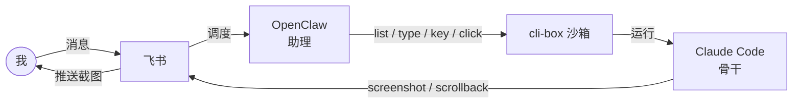

# 我写了一个小工具,让 OpenClaw 更好地使用 Claude Code

我平时想把开发活稳定地干完,又想随时在飞书里随手遥控。OpenClaw 的飞书 / IM 体验很好,但用着用着任务会丢;Claude Code 代码强、上下文稳,但 IM 体验弱。于是我写了个小工具 **cli-box**,把两者串起来:OpenClaw 当助理负责调度,Claude Code 当骨干负责干活,飞书把进展推回给我。

这是我目前在做、也还在完善的一个实践,整条链路大概是这样:

*图 1 · 整条链路:我从飞书发消息 → OpenClaw 调度 → cli-box 操作 Claude Code → 截图 / 回读再推回飞书给我。*

## 遇到的问题

我想要的东西其实很简单:能在飞书里随手遥控,把开发活稳定地干完。

**OpenClaw(用的 minimax 模型)**:飞书 / IM 的接入生态和体验很好,随手聊、随时收消息。但跑一段时间任务就容易丢,扛不住一段正经的代码开发。

**Claude Code**:代码能力强、上下文管理稳、不容易丢,关掉窗口也能用 `claude -r` 接着干。但它在 IM 接入和日常交互体验上弱一截。

| | OpenClaw(minimax) | Claude Code |
|:---|:---|:---|
| IM / 飞书接入 | 好 | 弱 |
| 代码开发 | 弱(任务易丢) | 强 |
| 上下文 / 记忆 | 易丢 | 稳,可 `-r` 恢复 |

单用哪一个都不行——我想在飞书里稳稳地遥控开发,两边都差一口气。

## 怎么解决的

思路其实很直:不二选一,组合,让各自干擅长的事。让 OpenClaw 当助理(接消息、调度、汇报),Claude Code 当骨干(写码、跑长任务)——这个比喻点到为止,后面就不反复说了。

问题是,助理得能"操作"和"查看"骨干,中间缺一个粘合剂。于是我写了 cli-box 这个小工具,给外部提供一组简单 CLI:`list` 管理、`type` / `key` / `click` 操作、`scrollback` 读、`screenshot` 看。

这么搭下来,有两个我觉得比较关键的好处:

**一是对我——交互和可见。** OpenClaw 把 Claude Code 的截图准确方便地推到飞书给我,我们之间就有了交互闭环;更重要的是我能**亲眼看到** Claude 的真实运行状态,而不是只听 OpenClaw 转述。OpenClaw 说不准、给我错误反馈还没法纠正——这个隐患就被绕开了。

**二是对 OpenClaw——降低了门槛。** 它只需要会发几条简单 CLI、会看截图和 scrollback,就能驱动 Claude Code 干活。换句话说,**对它背后模型的代码能力、上下文管理、记忆要求都大幅降低了**。真正费脑子的活由 Claude Code 扛,所以 OpenClaw 用相对弱的模型(minimax)也能当好调度。

## cli-box 做了什么

cli-box 是 macOS 上的一个小沙箱工具:一条命令把任意 CLI(Claude Code、OpenCode、zsh……)跑在各自独立的窗口里,而且这些窗口能被外部程序用简单命令操作和观察。

它给外部提供的就这么几类能力:

| 类别 | 命令 | 干什么 |
|:---|:---|:---|
| 管 | `list` | 列出当前所有沙箱 |
| 操作 | `type` / `key` / `click` | 输入文字 / 按键 / 点坐标 |
| 读 | `scrollback` | 读整段会话纯文本 |
| 看 | `screenshot` | 截当前窗口 |

它能当粘合剂,靠的是三点:**零侵入**(Claude Code 不用做任何适配,操作都在系统层面完成)、**可观测**(截图 + scrollback 让"看"和"读"都可靠)、**可控**(外部用几条简单 CLI 就能驱动)。

目前体会到的好处,也呼应前面那两点:OpenClaw 不必亲自写码,所以对它的模型要求很低,Claude Code 的强项被用在该用的地方;我通过飞书拿到准确的视觉反馈,能及时纠正。

## 写在最后

cli-box 把 OpenClaw 和 Claude Code 串起来,搭出来的就是这么一个简易但够用的干活方式。

说实话,功能仍在完善,这里只是分享当前的形态和思路,不算什么成熟方案。

如果你想自己动手配一遍(飞书接入、发图、定时检查这些细节),我写在另一篇里:→ [AI Agent + OpenClaw + 飞书实战工作流](./ai-agent-openclaw-workflow.md)。

<!-- TODO(作者补充):这里放一两个真实使用示例 / 截图 -->
