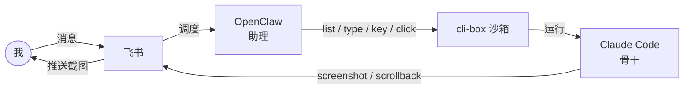

# 《我写了一个小工具,让 OpenClaw 更好地使用 Claude Code》撰写计划

> **For agentic workers:** REQUIRED SUB-SKILL: Use superpowers:subagent-driven-development (recommended) or superpowers:executing-plans to implement this plan task-by-task. Steps use checkbox (`- [ ]`) syntax for tracking.
>
> **本环境注:** subagent 派发不可用(见 memory `feedback-inline-execution`),走 **executing-plans 内联执行**。

**Goal:** 在 `docs/` 根目录撰写一篇约 800–1200 字的实践分享 markdown,介绍"用 cli-box 把 OpenClaw 和 Claude Code 串联"的实践。

**Architecture:** 单文件 `docs/openclaw-claude-cli-box-practice.md`,结构 = TL;DR + 4 节。视觉 = 1 张 Mermaid 数据流图 + 2 张 markdown 表格。按节拆 5 个 Task,逐节 append 并 commit。

**Tech Stack:** Markdown + Mermaid(`flowchart LR`)

## Global Constraints

> 来自 spec(`docs/superpowers/specs/2026-06-25-openclaw-claude-cli-box-practice-design.md`,commit fd1383c),逐字约束,每个 Task 隐式遵守。

- **调性克制诚实**:`❌ 禁用` 框架 / 强大 / 高效 / 完美 / 终极 / 一站式 / 赋能;`✅ 多用` 实践 / 尝试 / 目前 / 简易 / 够用 / 进行中 / 体会到
- **角色比喻**(助理 / 骨干 / 老板)全文**最多轻提一次**,不贯穿
- **收尾**须含"功能仍在完善,本文只分享当前形态与思路"
- **"好处"**一律写成"目前体会到的好处"
- **不讲**:飞书应用配置、发图脚本、cron 细节、授权规则(属 `docs/ai-agent-openclaw-workflow.md`)
- **不放**:命令教程、真实示例截图 / 对话(作者后续自补)
- **产品名大小写**:OpenClaw / Claude Code / cli-box / 飞书(规范写法)
- **语言**:中文
- **目标文件**:`docs/openclaw-claude-cli-box-practice.md`
- **工作分支**:`docs/introduce_in_openclaw_and_claude`(worktree:`.worktrees/docs-introduce`,基于 `origin/main` @ e79c3ab)
- **两个并重的核心动机**(本文主轴,第 2、3 节都要落到位):
  1. 对我 —— 交互与可见(截图推飞书形成闭环 + 亲眼看 Claude 真实状态,纠正 OpenClaw 转述失真)
  2. 对 OpenClaw / 系统 —— 降低门槛(简单 CLI 驱动 Claude Code → 对模型的代码能力、上下文、记忆要求大幅降低;重活 Claude Code 扛,弱模型也能当调度)

## 通用验证命令(各 Task 复用)

```bash
# 1) 禁用词扫描(应无输出)
grep -nE '框架|强大|高效|完美|终极|一站式|赋能' docs/openclaw-claude-cli-box-practice.md

# 2) 全文字符数(目标 800–1200,Task 5 收尾时核对)
wc -m docs/openclaw-claude-cli-box-practice.md

# 3) 工作区在正确 worktree
git rev-parse --show-toplevel   # 应为 .../cli-box/.worktrees/docs-introduce
git branch --show-current       # 应为 docs/introduce_in_openclaw_and_claude
```

---

## Task 1: 创建文档 + 标题 + TL;DR + 图 1(数据流闭环)

**Files:**
- Create: `docs/openclaw-claude-cli-box-practice.md`

**Content brief:**
- 文档顶部标题(一级标题):《我写了一个小工具,让 OpenClaw 更好地使用 Claude Code》
- 紧接一段 TL;DR(2–3 句,约 80 字),点明三件事:① OpenClaw(IM 好但易丢任务)② Claude Code(代码强且稳、能 `-r` 恢复)③ 用小工具 cli-box 把两者串起来,OpenClaw 当助理调度、Claude Code 当骨干干活,飞书把进展推回给我。定调句:"这是我目前在做、也还在完善的一个实践。"
- 然后放**图 1**(Mermaid),展示完整闭环。用如下语法(可直接粘贴):



- 图下加一行图注:`图 1 · 整条链路:我从飞书发消息 → OpenClaw 调度 → cli-box 操作 Claude Code → 截图/回读再推回飞书给我。`

**Steps:**
- [ ] **Step 1:** 创建 `docs/openclaw-claude-cli-box-practice.md`,写入标题 + TL;DR 段 + 图 1 Mermaid + 图注
- [ ] **Step 2:** 运行 `grep -nE '框架|强大|高效|完美|终极|一站式|赋能' docs/openclaw-claude-cli-box-practice.md`,确认无输出
- [ ] **Step 3:** Commit

```bash
git add docs/openclaw-claude-cli-box-practice.md
git commit -m "docs: add article skeleton, TL;DR and data-flow diagram

Co-Authored-By: Claude <noreply@anthropic.com>"
```

**Verification:**
- 标题与 spec 一致;TL;DR 含 OpenClaw / Claude Code / cli-box 三要素 + "进行中"定调
- 禁用词扫描无输出
- Mermaid 为合法 `flowchart LR`,6 个节点 + 7 条边,闭合(我 → … → 我)

---

## Task 2: 第 1 节「遇到的问题」

**Files:**
- Modify: `docs/openclaw-claude-cli-box-practice.md`(在图 1 后 append)

**Content brief(约 220 字):**
- 二级标题:`## 遇到的问题`
- 开篇一句:先讲我本来想要什么——"能在飞书里随手遥控,把开发活稳定地干完。"
- 两段对比(各 2–3 句):
  - **OpenClaw(用的 minimax 模型)**:飞书 / IM 的接入生态和体验很好,随手聊、随时收消息。但跑一段时间任务容易丢,扛不住一段正经的代码开发。
  - **Claude Code**:代码能力强、上下文管理稳、不容易丢,关掉窗口也能用 `claude -r` 接着干。但它在 IM 接入和日常交互体验上弱一截。
- 插入**优劣对比表**(markdown 表格,直接用):

| | OpenClaw(minimax) | Claude Code |
|:---|:---|:---|
| IM / 飞书接入 | 好 | 弱 |
| 代码开发 | 弱(任务易丢) | 强 |
| 上下文 / 记忆 | 易丢 | 稳,可 `-r` 恢复 |

- 收一句痛点:"单用哪一个都不行——我想在飞书里稳稳地遥控开发,两边都差一口气。"

**Steps:**
- [ ] **Step 1:** append「遇到的问题」整节(含表格)
- [ ] **Step 2:** 禁用词扫描 + `wc -m` 看累计字符数
- [ ] **Step 3:** Commit

```bash
git add docs/openclaw-claude-cli-box-practice.md
git commit -m "docs: add 'the problem' section with comparison table

Co-Authored-By: Claude <noreply@anthropic.com>"
```

**Verification:**
- 三行对比表完整(IM / 代码 / 上下文三维度),措辞克制(无 hype)
- 痛点句点出"单用谁都不行"

---

## Task 3: 第 2 节「怎么解决的」—— 落第一个核心动机

**Files:**
- Modify: `docs/openclaw-claude-cli-box-practice.md`(append)

**Content brief(约 300 字):**
- 二级标题:`## 怎么解决的`
- 思路(2 句):不二选一,组合——让各自干擅长的事。这里**轻提一次**角色比喻:"让 OpenClaw 当助理(接消息、调度、汇报),Claude Code 当骨干(写码、跑长任务)。"——比喻就此打住,后文不再反复用。
- 引出 cli-box(2 句):助理要能"操作"和"查看"骨干,缺一个粘合剂。于是写了 cli-box 这个小工具,提供一组简单 CLI:`list` 管理、`type`/`key`/`click` 操作、`scrollback` 读、`screenshot` 看。
- 落**两个并重的好处**(本文主轴,用小标题或加粗分两点写,务必都到位):
  1. **对我 —— 交互和可见**:OpenClaw 把 Claude Code 的截图准确方便地推到飞书给我,我们之间就有了交互闭环;更重要的是我能**亲眼看到** Claude 的真实运行状态,而不是只听 OpenClaw 转述——避免它说不准、给我错误反馈还没法纠正。
  2. **对 OpenClaw —— 降低了门槛**:它只需要会发几条简单 CLI、会看截图和 scrollback,就能驱动 Claude Code 干活。换句话说,**对它背后模型的代码能力、上下文管理、记忆要求都大幅降低了**;真正费脑子的活由 Claude Code 扛,所以 OpenClaw 用相对弱的模型(minimax)也能当好调度。

**Steps:**
- [ ] **Step 1:** append「怎么解决的」整节,确保两个好处都写到位
- [ ] **Step 2:** 自检——本节同时出现"交互/可见"与"降低门槛/对模型要求"两条线索;禁用词扫描
- [ ] **Step 3:** Commit

```bash
git add docs/openclaw-claude-cli-box-practice.md
git commit -m "docs: add 'how I solved it' with the two core motivations

Co-Authored-By: Claude <noreply@anthropic.com>"
```

**Verification:**
- 两个好处都明确写出(不是只写一个)
- "降低对模型代码能力/上下文/记忆要求"这一关键洞察在文中出现
- 比喻只出现这一次

---

## Task 4: 第 3 节「cli-box 的机制与好处」—— 落第二个核心动机 + 能力表

**Files:**
- Modify: `docs/openclaw-claude-cli-box-practice.md`(append)

**Content brief(约 320 字):**
- 二级标题:`## cli-box 做了什么`
- 是什么(2 句):cli-box 是 macOS 上的一个小沙箱工具——一条命令把任意 CLI(Claude Code、OpenCode、zsh…)跑在各自独立的窗口里,而且这些窗口能被外部程序用简单命令操作和观察。
- 能力(配**能力表**,直接用):

| 类别 | 命令 | 干什么 |
|:---|:---|:---|
| 管 | `list` | 列出当前所有沙箱 |
| 操作 | `type` / `key` / `click` | 输入文字 / 按键 / 点坐标 |
| 读 | `scrollback` | 读整段会话纯文本 |
| 看 | `screenshot` | 截当前窗口 |

- 为什么它能当粘合剂(3 个短点):
  - **零侵入**:Claude Code 不用做任何适配,所有操作都在系统层面完成。
  - **可观测**:截图 + scrollback 让"看"和"读"都可靠。
  - **可控**:外部(OpenClaw)用几条简单 CLI 就能驱动。
- 收「**目前体会到的好处**」(呼应第 2 节两点,简短):
  - **降低门槛**:OpenClaw 不必亲自写码,所以对它的模型要求很低;Claude Code 的强项被用在该用的地方。
  - **可见可控**:我通过飞书拿到准确的视觉反馈,能及时纠正。

**Steps:**
- [ ] **Step 1:** append「cli-box 做了什么」整节(含能力表 + 好处)
- [ ] **Step 2:** 禁用词扫描;确认能力表 4 行齐全
- [ ] **Step 3:** Commit

```bash
git add docs/openclaw-claude-cli-box-practice.md
git commit -m "docs: add 'what cli-box does' with capability table and benefits

Co-Authored-By: Claude <noreply@anthropic.com>"
```

**Verification:**
- 能力表含 管/操作/读/看 四类
- "零侵入 / 可观测 / 可控"三点在
- 好处段落用"目前体会到的好处"措辞,且呼应两个动机

---

## Task 5: 第 4 节「收尾」+ 全文自检 + Mermaid 校验

**Files:**
- Modify: `docs/openclaw-claude-cli-box-practice.md`(append 收尾节)
- (只读)对照 spec

**Content brief(约 100 字):**
- 二级标题:`## 写在最后`
- 一句总结:"cli-box 把 OpenClaw 和 Claude Code 串起来,搭出来的就是这么一个简易但够用的干活方式。"
- **诚实声明**(必须):"功能仍在完善,这里只是分享当前的形态和思路,不算什么成熟方案。"
- 引导复现(一句 + 链接):"如果你想自己动手配一遍(飞书接入、发图、定时检查的细节),我写在另一篇里:→ [AI Agent + OpenClaw + 飞书实战工作流](./ai-agent-openclaw-workflow.md)。"
- 示例占位(留一行给作者):`<!-- TODO(作者补充):这里放一两个真实使用示例 / 截图 -->`

**Steps:**
- [ ] **Step 1:** append「写在最后」整节
- [ ] **Step 2:** 全文检查 ——
  - 禁用词扫描(应无输出)
  - `wc -m docs/openclaw-claude-cli-box-practice.md`(目标 800–1200 中文字符;若超出 1300 或不足 700,回前面节精简/补充)
  - Mermaid 语法:确认图 1 在一个完整 ` ```mermaid ` 代码块内,`flowchart LR` 开头
  - 链接有效:`ls docs/ai-agent-openclaw-workflow.md`(应存在)
- [ ] **Step 3:** Commit

```bash
git add docs/openclaw-claude-cli-box-practice.md
git commit -m "docs: add closing section and finalize article

Co-Authored-By: Claude <noreply@anthropic.com>"
```

**Verification:**
- 收尾含"功能仍在完善"声明 + workflow 文档链接 + 示例占位
- 全文 800–1200 字,禁用词 0 命中
- 5 个 commit(本 Task 是第 5 个),分支 `docs/introduce_in_openclaw_and_claude` ahead origin/main 共 6(spec 1 + 文档 5)
- `git log --oneline e79c3ab..HEAD` 看到 6 个干净 commit

---

## Self-Review(计划自检)

**1. Spec coverage(spec 每节 → Task):**
- spec §0 TL;DR → Task 1 ✓
- spec §1 遇到的问题 + 对比表 → Task 2 ✓
- spec §2 怎么解决 + 两个动机 → Task 3 ✓
- spec §3 机制 + 能力表 + 好处 → Task 4 ✓
- spec §4 收尾(诚实声明 + 链接 + 占位)→ Task 5 ✓
- spec §3 调性约束 → Global Constraints + 每 Task 禁用词扫描 ✓
- spec §5 图 1 Mermaid → Task 1 ✓
- spec §8 YAGNI(不讲配置/不放示例)→ Global Constraints ✓

**2. Placeholder scan:** 计划内无 TBD/TODO(示例占位 `<!-- TODO(作者补充)-->` 是**有意留给作者**的,不是计划占位);每个 step 有具体内容 / 命令 / 表格 / Mermaid 语法。

**3. Type consistency:** 文件名全文统一 `docs/openclaw-claude-cli-box-practice.md`;产品名统一 OpenClaw / Claude Code / cli-box;两处"好处"措辞统一为"目前体会到的好处"。

**无问题,可执行。**
